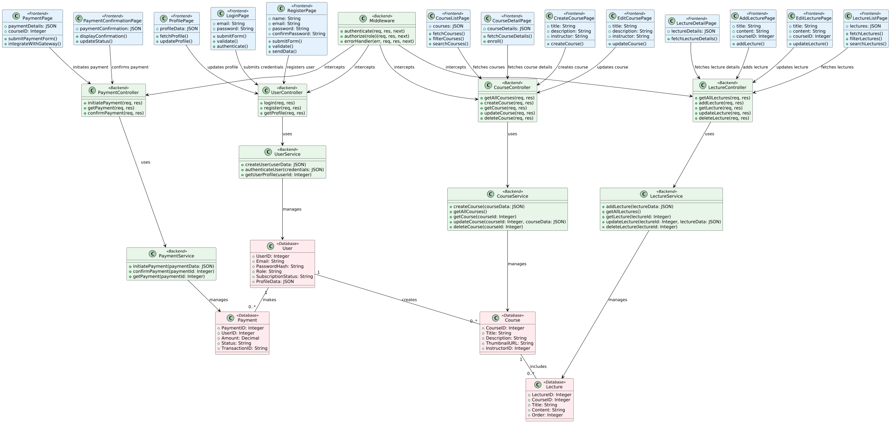

# LMS(Learning Management System )

This repository contains the source code and implementation of a Learning Management System (LMS) developed using the MERN stack (MongoDB, Express.js, React, Node.js) along with Tailwind CSS and DaisyUI for styling, Cloudinary for managing media, and Razorpay for subscription management.

## VIDEO 

https://youtu.be/T8YZitqdlEY

## Table of Contents

- [Overview](#overview)
- [Features](#features)
- [Installation](#installation)
- [Subscription Management](#subscription-management)
- [Prerequisites](#prerequisites)
- [Contributing](#contributing)
- [Further-Support](#further-support)

## Overview

The Learning Management System (LMS) is a web-based application that facilitates the management and delivery of educational content and training materials. It allows administrators to create courses, manage users, and track progress. Users can access courses, view content, and complete assessments. Additionally, it offers subscription management through Razorpay, allowing users to purchase and cancel subscriptions.

## Features

- User authentication and authorization (using JWT)
- Course creation, modification, and deletion
- Content upload and management via Cloudinary
- User enrollment in courses and progress tracking
- Interactive user interface using React and Tailwind CSS
- Subscription management with Razorpay (for premium content)

## Admin Login Credentials

By default, the LMS comes with an admin account. Use the following credentials to log in:

- **Email-1:** `adminDemo@gmail.com`
- **Password-1:** `123456789@Lms`

- **Email-2:** `adminDemo2@gmail.com`
- **Password-2:** `123456789@Lms`
  
## User Login Credentials

By default, the LMS comes with an admin account. Use the following credentials to log in:

- **Email-1:** `user1@gmail.com`
- **Password-1:** `123456789@Lms`

## Installation

 Clone the project 

```bash
git@github.com:Princegupta101/Larning-Management-System.git
```

### Setup instruction  for Frontend

1. Move into the directory

```bash
cd Client
```
2. install  dependenices

```bash
npm install
```
3.  run the server

```bash
npm run dev
```

### Setup instruction  for Backend

1. Move into the directory

```bash
cd Server
```
2. install  dependenices

```bash
npm install
```
3.  run the server

```bash
npm run dev
```
4.  Set up environment variables:
   Create a `.env` file in the `server` directory and add the following:

```bash
    PORT = <Port number >
    MONGODB_URL=<Connection_LINK>
    JWT_SECRET = <YOUR_LONG_JWT_SECRET>
    JWT_EXPIRY = <JWT_EXPIRY>

    FRONTEND_URL = <YOUR_FRONTEND_WEBSITE_URL>

    CONTACT_US_EMAIL = <YOUR_CONTACT_US_EMAIL>

    CLOUDINARY_CLOUD_NAME = <YOUR_CLOUDINARY_CLOUD_NAME>
    CLOUDINARY_API_KEY = <YOUR_CLOUDINARY_API_KEY>
    CLOUDINARY_API_SECRET = <YOUR_CLOUDINARY_API_SECRET>

    SMTP_HOST = <YOUR_SMTP_HOST>
    SMTP_PORT = <YOUR_SMTP_POST>
    SMTP_USERNAME = <YOUR_SMTP_USERNAME>
    SMTP_PASSWORD = <YOUR_SMTP_PASSWORD>
    SMTP_FROM_EMAIL = <YOUR_SMTP_FROM_EMAIL>

    RAZORPAY_KEY_ID = <YOUR_RAZORPAY_KEY>
    RAZORPAY_SECRET = <YOUR_RAZORPAY_SECRET>
    RAZORPAY_PLAN_ID = <YOUR_RAZORPAY_PLAN_ID>
```

## Subscription Management

- Users can purchase subscriptions for accessing premium content or features.
- Implement a subscription management interface that allows users to:
  - View available subscription plans
  - Select and purchase a subscription plan via Razorpay
  - Cancel an existing subscription

## Low Level Diagram


## Prerequisites

Before running this project locally, ensure you have the following installed:

- [Node.js](https://nodejs.org/) (v14.x or higher)
- [npm](https://www.npmjs.com/) (v6.x or higher)
- [MongoDB](https://www.mongodb.com/) (v4.x or higher)
- [Cloudinary](https://cloudinary.com/) account and API credentials
- [Razorpay](https://razorpay.com/) account and API credentials

## Contributing

We welcome contributions to Learning Management System  Feel free to create pull requests with your enhancements or bug fixes. Please ensure your contributions adhere to the coding style and conventions used in the project.

## Further-Support

If you encounter any issues or have questions, feel free to raise them as GitHub issues, and we'll be happy to assist you.
